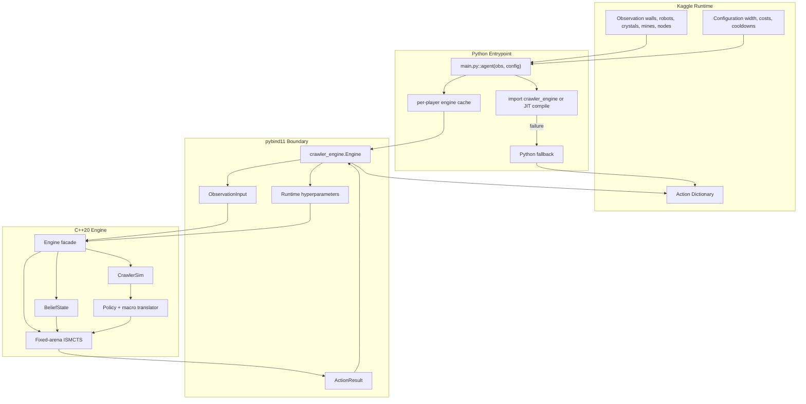
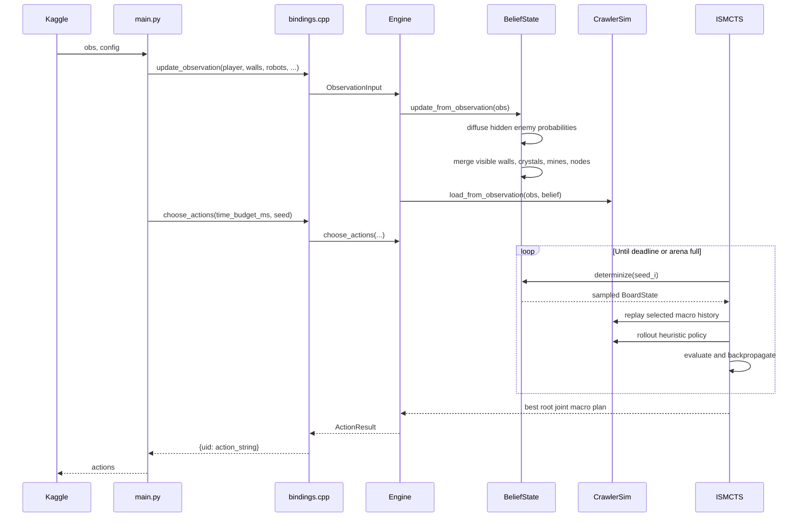
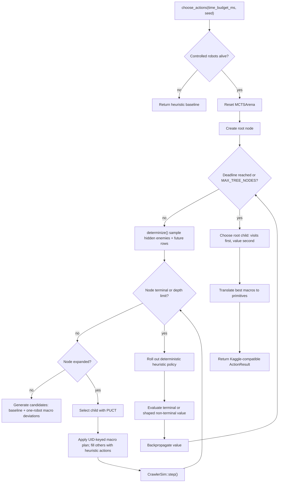

# Architecture

This document describes the Maze Crawler native engine: its layers, data flow, search loop, data model, algorithmic foundation, and the Python API. It is written against the current implementation and is the reference for how the pieces fit together.

## Overview

The system is split along ownership boundaries. Python owns the Kaggle lifecycle, native import and JIT compilation, fallback behavior, and packaging. C++ owns every latency-sensitive decision path: state ingestion, belief update, determinization, simulation, policy, search, and action serialization.

The engine searches over sampled hidden worlds. Each ISMCTS iteration samples a concrete `BoardState` from the belief model, replays the selected UID-keyed joint macro plan through the simulator, rolls the state out with a deterministic heuristic policy, and backpropagates a shaped value.

## System Layers

| Layer | Implementation | Responsibility |
| --- | --- | --- |
| Kaggle entrypoint | `main.py` | Persistent per-player engines, native import or JIT build, `{uid: "ACTION"}` output |
| Python/C++ bridge | `src/crawler_engine_bindings.cpp` | Observation conversion to fixed buffers, hyperparameter injection |
| Belief model | `src/crawler_engine_belief.cpp` | Fog-of-war memory and hidden-enemy probability fields |
| Rule simulator | `src/crawler_engine_sim.cpp` | Deterministic turn resolution in the competition phase order |
| Policy and macros | `src/crawler_engine_policy.cpp` | Cooldown-aware pathfinding, rollout policy, macro generation and translation |
| Search | `src/crawler_engine_mcts.cpp` | Fixed-arena ISMCTS with PUCT selection and root action extraction |
| Facade | `src/crawler_engine_engine.cpp` | Wires belief, simulator, and search for one player |
| State containers | `src/crawler_engine_state.cpp` | SoA robot store, absolute board arrays, Bitboards, action buffers |

Headers live in `src/include/` under `crawler_engine.hpp` (umbrella), `constants.hpp`, `enums.hpp`, `observation.hpp`, `board.hpp`, `search.hpp`, `engine.hpp`, and `crawler_engine_internal.hpp`.

## Data Flow



## Native Turn Pipeline

`Engine::update_observation()` updates the belief state first, then rebuilds the concrete simulator snapshot from visible facts and remembered information. `Engine::choose_actions()` runs the search over that snapshot under a per-turn millisecond budget.



## Search Loop

The search tree is an information-set tree. Tree nodes store UID-keyed joint macro plans, not simulator-local robot indices, so the same action history can be replayed across sampled hidden states. When `search_threads > 1`, independent per-thread searches run in parallel and their root statistics are aggregated by joint plan.



## Rule Engine Phase Machine

`CrawlerSim::step()` resolves the deterministic phase order. The order mirrors the competition rules and is covered by regression tests.

```mermaid
flowchart LR
    A["1. Cooldown tick"] --> B["2. Action validation"]
    B --> C["3. Energy drain"]
    C --> D["4. Special actions: transform, walls, builds, transfers"]
    D --> E["5. Movement and combat"]
    E --> F["6. Crystal collection"]
    F --> G["7. Mine energy fill"]
    G --> H["8. Mine generation"]
    H --> I["9. Scroll advancement"]
    I --> J["10. Boundary destruction"]
    J --> K["11. Rewards and winner update"]
```



## Data Model

### Fixed Limits

| Constant | Value | Meaning |
| --- | ---: | --- |
| `WIDTH` | 20 | Maze columns |
| `HEIGHT` | 20 | Active window height |
| `ACTIVE_CELLS` | 400 | Cells in the current tactical window |
| `MAX_ROWS` | 512 | Absolute row memory horizon |
| `MAX_CELLS` | 10240 | Absolute board storage cells |
| `MAX_ROBOTS` | 512 | Fixed robot store capacity |
| `MAX_MACROS` | 16 | Macro intents per robot |
| `MAX_TREE_NODES` | 16384 | MCTS arena node capacity |
| `MAX_MCTS_PLAN_ROBOTS` | 64 | Controlled robots in one joint plan |
| `MAX_MCTS_CANDIDATES` | 64 | Expansion cap for root joint plans |
| `MCTS_TREE_DEPTH` | 24 | Maximum tree traversal depth |
| `EPISODE_STEPS` | 501 | Episode length; the last agent call is step 499 |

### Structure-of-Arrays Robots

Robot attributes live in separate contiguous arrays (`uid`, `alive`, `type`, `owner`, `col`, `row`, `energy`, `move_cd`, `jump_cd`, `build_cd`). This layout suits repeated full-store scans during simulation, policy generation, reward calculation, and action construction. Dead slots are recycled, while UIDs remain the stable external identity used by Kaggle and by MCTS plan replay.

Factory energy uses `int32_t` because factories have no gameplay energy cap and transfers or collection can push values beyond small integer ranges.

### Absolute Map Memory and Active Bitboards

The board is represented twice:

- Absolute arrays indexed by `row * WIDTH + col` across `MAX_ROWS`. These store walls, wall knowledge, crystals, mines, mine ownership, mine capacity, and mining nodes.
- Active-window Bitboards indexed by `(row - south_bound) * WIDTH + col`. These summarize occupancy, visibility, crystals, mines, and nodes for the current tactical window.

Absolute memory preserves discovered world facts across scrolling; Bitboards make the current window cheap to scan.

## Algorithmic Foundation

### Branching Factor Control

A naive simultaneous-move tree branches over every legal primitive action for every controlled robot:

```math
B_{\text{primitive}} = \prod_{r \in R} |A_r|
```

The engine instead builds one deterministic baseline joint plan and adds one-robot macro deviations:

```math
B_{\text{macro}} \le 1 + \sum_{r \in R'} \left(|M_r| - 1\right)
```

where `R'` is capped by `MAX_MCTS_PLAN_ROBOTS` and the final candidate list is capped by `MAX_MCTS_CANDIDATES`.

### Belief and Determinization

The belief state is player-centric. Visible facts overwrite memory, remembered facts persist where the rules allow, and hidden enemies are tracked as per-type probability fields. Each type carries one probability field over absolute cells:

```math
P_t^{(k)}(x)
```

When enemies leave vision, probability mass diffuses through passable or unknown neighbor cells and can also remain stationary:

```math
P_{t+1}^{(k)}(x') \mathrel{+}= \frac{P_t^{(k)}(x)}{1 + |\mathcal{N}(x)|}
```

for `x'` in the current cell plus its passable neighbors. Diffusion radius is capped to keep large step gaps bounded. Visible cells are excluded from hidden sampling so observed enemies are never duplicated, and the facade adds a safety net that removes any synthetic enemy coinciding with an observed one.

Each determinization samples one or more hidden enemies per type (up to three), copies known facts exactly, generates plausible unknown rows near the frontier, and reinserts all observed live robots by UID with exact position, energy, and cooldowns.

### PUCT Selection

Child selection uses PUCT:

```math
\begin{aligned}
\text{score}(s,a) =\;&
Q(s,a) +
C_{\text{puct}} P(s,a)
\frac{\sqrt{N(s)+1}}{N(s,a)+1}
\end{aligned}
```

where `Q(s,a) = W(s,a) / N(s,a)`. `C_puct`, rollout depth, the baseline prior multiplier, and every macro prior are runtime hyperparameters.

### Joint Macro Priors

Each candidate is a UID-keyed joint macro plan. Its prior is the average of the participating robot macro priors:

```math
\tilde{P}(\pi) = \frac{1}{|\pi|} \sum_{(u,m) \in \pi} p_m
```

The deterministic baseline receives an additional multiplier, and when that prior still trails the strongest deviation the baseline is nudged just above it so the coordinated plan remains selectable. All candidate priors are normalized before child creation.

### Cooldown-Aware Pathfinding

The deterministic policy uses BFS over active cells and jump cooldown state:

```math
v = (c, r, j)
```

where `j` is the remaining Factory jump cooldown or a sentinel for units that cannot jump. Movement edges decrement the cooldown; jump edges move two cells and reset it.

### Rollout Value Function

Terminal states follow the competition priorities: Factory survival, then energy, then unit count. Non-terminal rollout leaves blend energy, material, unit count, Factory progress, scroll margin, mine income, and Factory proximity:

```math
\begin{aligned}
V(s) =\;&
0.50 \tanh \left( \frac{\Delta E}{1000} \right)
+ 0.20 \tanh \left( \frac{\Delta M}{10} \right) \\
&+ 0.10 \tanh \left( \frac{\Delta U}{8} \right)
+ 0.10 \tanh \left( \frac{\Delta R_f}{8} \right)
+ 0.05 \tanh \left( \frac{\Delta S_f}{8} \right) \\
&+ 0.05 \tanh \left( 0.5 \, \Delta N \right)
- 0.05 \, T_f
\end{aligned}
```

where `Delta E` is energy margin, `Delta M` is material margin, `Delta U` is unit margin, `Delta R_f` is best Factory row margin, `Delta S_f` is Factory distance from the scroll boundary, `Delta N` is the friendly mine-count margin, and `T_f` is a Factory-proximity threat term.

### Policy Vocabulary

The baseline planner and the macro library implement several strategic behaviors:

- Factory survival: emergency north jump near the scroll, cooldown-aware advance.
- Factory economy: builds Workers, then Scouts, and a Miner when a mining node is known nearby.
- Factory mine harvest: routes to a friendly mine before the scroll takes it.
- Worker support: transfers energy to adjacent underfilled Workers.
- Worker walls: removes blocking north walls; escorts the Factory or advances.
- Scout economy: returns energy when loaded, hunts visible crystals, otherwise explores north.
- Miner economy: seeks the nearest known mining node and transforms on it.

The full macro list and its tuned priors are documented in `config/hyperparameters.json`.

## Python API

The pybind module exposes a compact API for debugging and integration:

```python
import crawler_engine

engine = crawler_engine.Engine(player=0)
engine.update_observation(
    player, walls, crystals, robots, mines, mining_nodes,
    southBound, northBound, step,
)
actions = engine.choose_actions(time_budget_ms=2000, seed=123)
```

Hyperparameters are per-engine:

```python
engine.set_hyperparameters({
    "C_puct": 2.0,
    "baseline_prior_multiplier": 1.2,
    "rollout_depth": 64,
})
print(engine.get_hyperparameters())
```

Debug helpers:

- `engine.step(actions)` applies primitive actions to the current simulator snapshot.
- `engine.determinize(seed)` returns a summary of one sampled hidden state.
- `engine.debug_state()` returns a summary of the concrete simulator snapshot.
- `engine.debug_mcts_value(player)` returns the evaluator value for the current state.
- `crawler_engine.action_name(int_action)` and `crawler_engine.macro_action_name(int_macro)` return action strings.

## Threading and Performance

- Root-parallel ISMCTS: each thread owns an independent arena and reads shared state immutably.
- The search loop is allocation-free; per-iteration work uses fixed `std::array` scratch.
- The deadline is checked periodically inside the worker loop, and the single-threaded path reuses the arena across turns with a storage reset.
- `search_threads` defaults to one and is settable per engine.

## Environment Rules Fidelity

The simulator is calibrated against the Kaggle interpreter:

- Scroll cadence starts at 10 turns and ramps linearly to 2 turns by step 450.
- The episode ends after turn 499 (`EPISODE_STEPS - 2`).
- Factory jumps require both the move and jump cooldowns to be zero.
- Off-board north/south moves are blocked only by the source cell wall.
- Spawned robots start with a move cooldown equal to their move period.

`scripts/diffcheck.py` and `tests/test_differential.py` lock these behaviors so changes cannot silently regress simulator fidelity.
