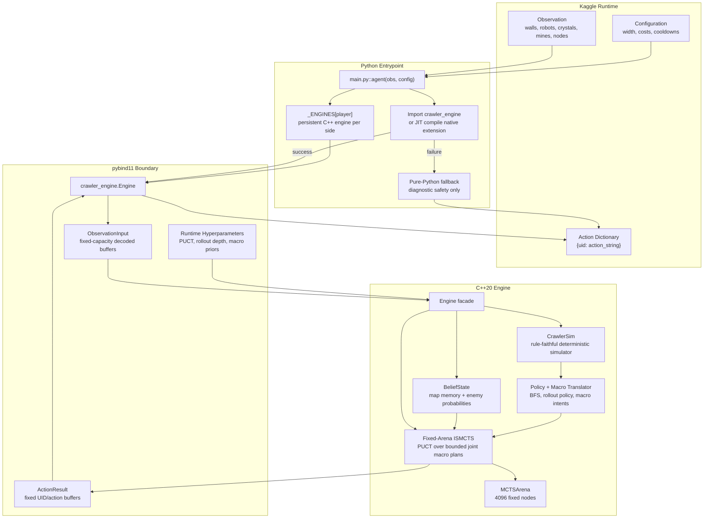
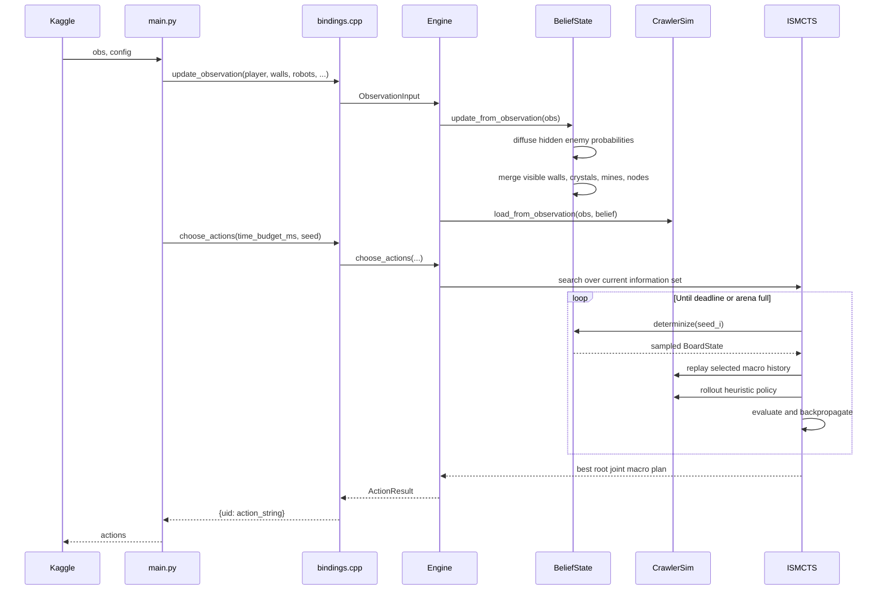
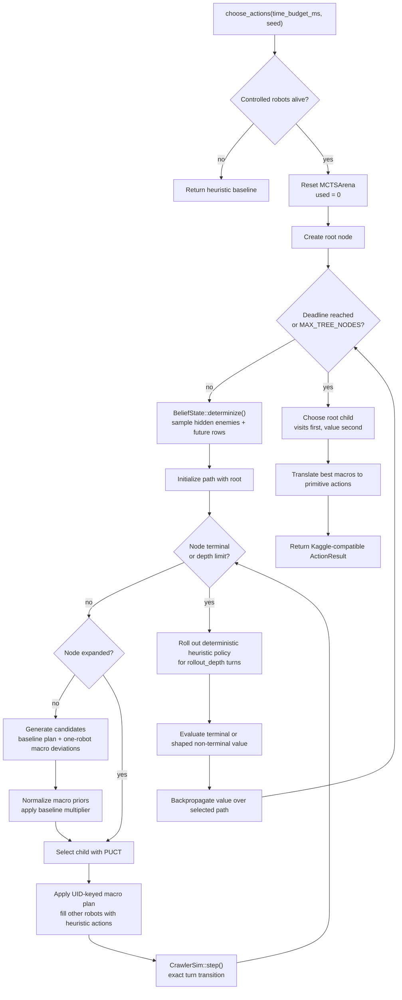
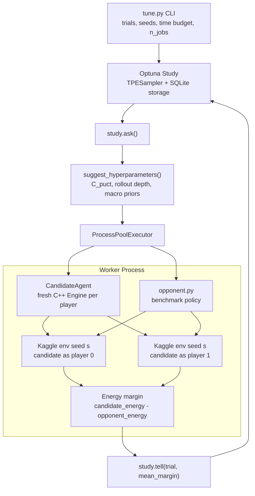

# Maze Crawler ISMCTS

### Fixed-buffer Information Set Monte Carlo Tree Search (ISMCTS) agent for Kaggle Maze Crawler.

This repository implements a high-performance Maze Crawler agent whose competitive core is a native C++20 engine exposed through a thin Python `main.py` Kaggle entrypoint. The solution combines a rule-faithful deterministic simulator, a player-centric hidden-information belief model, cache-friendly state containers, and a fixed-arena ISMCTS search that reasons over bounded joint macro plans instead of the intractable primitive action product.

The central engineering breakthrough is search-space compression. Maze Crawler is a simultaneous-move, fog-of-war strategy game where every robot can select from many primitive actions every turn. A direct joint action search grows as a Cartesian product over all live robots. This engine replaces that explosion with a strong deterministic baseline plan plus one-robot macro deviations, then evaluates those plans through PUCT-guided ISMCTS on sampled determinizations of the hidden world. The result is a Kaggle-compatible agent that preserves tactical lookahead, respects partial observability, and remains within strict per-turn runtime budgets.

<p align="center">
    
</p>

## Competitive Architecture at a Glance

| Layer | Implementation | Purpose |
| --- | --- | --- |
| Kaggle entrypoint | `main.py` | Owns persistent per-player engines, performs runtime native import/JIT build, returns `{uid: "ACTION"}` dictionaries. |
| Python/C++ bridge | `src/bindings.cpp` | Converts Kaggle observation dictionaries into fixed C++ buffers through pybind11 and exposes hyperparameter injection. |
| Belief model | `src/crawler_engine_belief.cpp` | Maintains remembered map facts, visible facts, and per-type enemy probability fields under fog of war. |
| Rule simulator | `src/crawler_engine_sim.cpp` | Executes Maze Crawler turn order exactly with fixed scratch arrays and deterministic state transitions. |
| Policy and macros | `src/crawler_engine_policy.cpp` | Provides cooldown-aware pathfinding, rollout behavior, macro generation, and macro-to-primitive translation. |
| Search | `src/crawler_engine_mcts.cpp` | Runs fixed-arena ISMCTS with PUCT selection, bounded joint macro expansion, rollout evaluation, and root action extraction. |
| Tuning | `tune.py` | Runs process-parallel Optuna studies against `opponent.py`, persisted to SQLite and evaluated with side-swapped seeds. |
| Packaging | `package_submission.py` | Produces a Kaggle source bundle with `main.py`, C++ sources, headers, and vendored pybind11 includes. |

## Why This Solution is Different

- **Native hot path:** simulation, belief determinization, policy, and search run in C++20.
- **Zero-allocation search loop:** tree nodes, robots, board layers, action buffers, and rollout scratch structures are fixed-capacity `std::array` storage.
- **Structure-of-Arrays robot store:** robot attributes live in separate contiguous arrays for predictable iteration and compact copy semantics.
- **Active-window bitboards:** the 20x20 tactical window is rebuilt into `uint64_t` masks for occupancy, visibility, crystals, mines, and nodes.
- **Absolute map memory:** persistent world facts are indexed by absolute `(row, col)` across `MAX_ROWS = 512`, so scrolling does not erase strategic memory.
- **Information-set search:** each MCTS iteration samples a concrete hidden state from belief, replays the selected macro history, and rolls out deterministically.
- **Macro action branching:** the agent branches over high-level intents such as `FACTORY_SAFE_ADVANCE`, `SCOUT_HUNT_CRYSTAL`, and `WORKER_OPEN_NORTH_WALL` rather than every primitive robot action combination.
- **Continuous evaluator:** rollout leaves are scored with smooth energy, material, unit, progress, and scroll-margin features aligned with the competition tiebreakers.
- **Source-first Kaggle deployment:** submissions do not depend on a prebuilt wheel; the bundled source JIT-compiles the native extension inside the Kaggle runtime.

## Competition Overview

This project targets [Kaggle's Maze Crawler Competition](https://www.kaggle.com/competitions/maze-crawler), a two-player strategy game on a 20-column maze that scrolls north over time. Each player begins with one Factory on opposite halves of an east/west symmetric map. The last player with a surviving Factory wins; if both survive to the time limit, the game is decided by total energy, then unit count, then draw.

Maze Crawler is difficult because it combines incomplete information, simultaneous movement, resource management, collision combat, map manipulation, and a moving survival boundary. The agent must advance its Factory northward, preserve energy, decide when to build support robots, exploit crystals and mines, manage cooldowns, avoid friendly-fire collisions, and infer hidden enemy positions from limited observations.

### Core Mechanics

| Robot | Cost | Max energy | Move period | Vision | Role |
| --- | ---: | ---: | ---: | ---: | --- |
| Factory | Initial unit | Unlimited | 2 | 4 | Builds units, jumps every 20 turns, must survive. |
| Scout | 50 | 100 | 1 | 5 | Fast exploration and crystal harvesting. |
| Worker | 200 | 300 | 2 | 3 | Builds/removes walls for navigation and defense. |
| Miner | 300 | 500 | 2 | 3 | Transforms on mining nodes into energy-generating mines. |

Each turn, the agent returns a dictionary mapping robot UIDs to action strings. Legal action families include movement, Factory builds and jumps, Worker wall edits, Miner transform, energy transfer, and idle.

Important mechanics implemented in the simulator include:

- Robots lose 1 energy per turn before executing special actions.
- Movement is simultaneous.
- Factories can build Scouts, Workers, and Miners into the cell directly north.
- Factory jumps ignore walls and move two cells, but destroy the Factory if the landing cell is off board.
- Workers can build or remove walls, including no-op fixed-wall attempts that still consume energy.
- Miners can transform on mining nodes into mines that generate energy.
- Energy transfers happen before movement and drain the source robot.
- Combat is crush-based: Factory > Miner > Worker > Scout.
- Same-type collisions destroy all robots of that type, including friendly units.
- The southern boundary advances faster over time and destroys anything behind it.
- Fog of war remembers walls and mines, but not crystals or enemy robots outside vision.

## Repository Layout

```text
.
├── CMakeLists.txt
├── main.py
├── opponent.py
├── package_submission.py
├── submission.py
├── test.py
├── tune.py
├── requirements-dev.txt
├── rules/
│   ├── README.md
│   └── AGENTS.md
└── src/
    ├── bindings.cpp
    ├── crawler_engine.hpp
    ├── crawler_engine_internal.hpp
    ├── crawler_engine_internal.cpp
    ├── crawler_engine_state.cpp
    ├── crawler_engine_belief.cpp
    ├── crawler_engine_sim.cpp
    ├── crawler_engine_policy.cpp
    ├── crawler_engine_mcts.cpp
    └── crawler_engine_engine.cpp
```

## System Architecture

The system is intentionally split along ownership boundaries. Python owns Kaggle lifecycle, native import, fallback behavior, and packaging. C++ owns every latency-sensitive decision path: state ingestion, belief update, determinization, simulation, policy, search, and action serialization.



### Native Turn Pipeline

`Engine::update_observation()` first updates belief, then rebuilds the concrete simulator snapshot from visible facts and remembered information. `Engine::choose_actions()` then performs the search using the latest `CrawlerSim` state.



### Search Loop

The search tree is an information-set tree. Nodes store UID-keyed joint macro plans, not simulator-local robot indices, so the same action history can be replayed across different hidden-state samples.



### Rule Engine Phase Machine

`CrawlerSim::step()` is a deterministic phase machine. The order below mirrors the competition rules and is regression-tested for the edge cases that materially affect search quality.

```mermaid
flowchart LR
    A["1. Cooldown tick"] --> B["2. Action type validation"]
    B --> C["3. Energy drain"]
    C --> D["4. Miner transform"]
    D --> E["5. Worker wall edits"]
    E --> F["6. Factory builds"]
    F --> G["7. Energy transfers"]
    G --> H["8. Simultaneous movement intents"]
    H --> I["9. Crush combat"]
    I --> J["10. Apply surviving movement"]
    J --> K["11. Crystal cleanup and collection"]
    K --> L["12. Mine pickup"]
    L --> M["13. Mine generation"]
    M --> N["14. Scroll advancement"]
    N --> O["15. Boundary destruction"]
    O --> P["16. Reward and winner update"]
    P --> Q["17. Rebuild active bitboards"]
```



## Data Model and Performance Engineering

The C++ engine uses fixed compile-time limits to avoid heap churn during simulation and search.

| Constant | Value | Meaning |
| --- | ---: | --- |
| `WIDTH` | 20 | Maze columns. |
| `HEIGHT` | 20 | Active visible window height. |
| `ACTIVE_CELLS` | 400 | Cells in the current tactical window. |
| `MAX_ROWS` | 512 | Absolute row memory horizon. |
| `MAX_CELLS` | 10,240 | Absolute board storage cells. |
| `MAX_ROBOTS` | 512 | Fixed robot store capacity. |
| `MAX_MACROS` | 16 | Maximum macro intents per robot. |
| `MAX_TREE_NODES` | 4,096 | MCTS arena node capacity. |
| `MAX_MCTS_PLAN_ROBOTS` | 64 | Controlled robots represented in one joint plan. |
| `MAX_MCTS_CANDIDATES` | 64 | Expansion cap for root-player joint macro plans. |
| `MCTS_TREE_DEPTH` | 24 | Maximum tree traversal depth. |
| `MCTS_ROLLOUT_DEPTH` | 48 | Compile-time rollout constant; runtime default is tuned to 80. |

### Structure-of-Arrays Robots

Robots are stored as a Structure of Arrays:

```text
uid[512][24]
alive[512]
type[512]
owner[512]
col[512]
row[512]
energy[512]
move_cd[512]
jump_cd[512]
build_cd[512]
```

This layout is well suited to repeated full-store scans during simulation, policy generation, reward calculation, action construction, and pybind debug summaries. Dead slots are recycled, while UIDs remain the stable external identity used by Kaggle and by MCTS plan replay.

Factory energy uses `int32_t` rather than `int16_t`. Factories have no gameplay energy cap, and transfers or collection can push them beyond small integer ranges. Terminal and rollout reward calculations accumulate energy margins in wider integer types before converting to floating-point values.

### Absolute Map Memory + Active Bitboards

The board is represented twice:

- **Absolute arrays:** `row * WIDTH + col` indexing across `MAX_ROWS`. These arrays store remembered walls, wall knowledge, crystals, mines, mine owners, mine capacities, and mining nodes.
- **Active-window bitboards:** `(row - south_bound) * WIDTH + col` indexing across the current 20x20 window. These masks store own occupancy, enemy occupancy, all occupancy, visibility, crystals, mines, and mining nodes.

This hybrid model is the correct fit for a scrolling maze: absolute memory preserves discovered world facts, while bitboards make the current tactical window cheap to rebuild and scan.

## Algorithmic and Mathematical Foundation

### Branching Factor Control

A naive simultaneous-move tree branches over every legal primitive action for every controlled robot:

```math
B_{\text{primitive}} = \prod_{r \in R} |A_r|
```

That is untenable as soon as the Factory has built multiple support units. This engine instead builds one deterministic baseline joint plan and then adds one-robot macro deviations:

```math
B_{\text{macro}} \le 1 + \sum_{r \in R'} \left(|M_r| - 1\right)
```

where $`R'`$ is capped by `MAX_MCTS_PLAN_ROBOTS = 64`, and the final candidate list is capped by `MAX_MCTS_CANDIDATES = 64`.

This preserves coordinated baseline behavior while giving MCTS the ability to test targeted tactical alternatives: build, jump, transfer, scout, return, escort, wall-open, mine-transform, or idle.

### Information-Set Determinization

The belief state is player-centric. Visible facts overwrite memory, remembered facts persist where the rules allow them to persist, and hidden enemies are tracked as per-type probability fields:

```math
P_t^{(k)}(x)
```

where $`k`$ is robot type and $`x`$ is an absolute board cell.

When enemies disappear into fog, probability mass diffuses through passable or unknown neighbor cells and can also remain stationary:

```math
P_{t+1}^{(k)}(x') \mathrel{+}= \frac{P_t^{(k)}(x)}{1 + |\mathcal{N}(x)|}
```

for $`x' \in \{x\} \cup \mathcal{N}(x)`$, where $`\mathcal{N}(x)`$ is the set of passable neighboring cells under known wall constraints. Current friendly vision zeroes impossible enemy locations. A newly observed enemy collapses its type distribution into a delta at the observed cell:

```math
P_t^{(k)}(x) =
\begin{cases}
1, & x = x_{\text{observed}} \\
0, & \text{otherwise}
\end{cases}
```

Each MCTS iteration samples one concrete `BoardState` from these fields, copies known facts exactly, generates plausible unknown future rows, and reinserts all currently observed live robots by exact UID, position, owner, energy, and cooldown.

### PUCT Selection

Child selection uses PUCT:

```math
\text{score}(s,a) =
Q(s,a) +
C_{\text{puct}} P(s,a)
\frac{\sqrt{N(s)+1}}{N(s,a)+1}
```

where:

```math
Q(s,a) = \frac{W(s,a)}{N(s,a)}
```

`C_puct`, rollout depth, the baseline prior multiplier, and every macro prior are runtime hyperparameters. The current tuned defaults are embedded in both `Hyperparameters` and `main.py`.

### Joint Macro Priors

Each candidate is a UID-keyed joint macro plan:

```math
\pi = \{(u_1, m_1), (u_2, m_2), \ldots, (u_n, m_n)\}
```

Its prior is the average of the participating robot macro priors:

```math
\tilde{P}(\pi) = \frac{1}{|\pi|} \sum_{(u,m) \in \pi} p_m
```

The deterministic baseline receives an additional multiplier:

```math
\tilde{P}_{\text{baseline}}(\pi) =
\beta \cdot \tilde{P}(\pi)
```

All candidate priors are normalized before child creation:

```math
P_i = \frac{\max(0, \tilde{P}_i)}{\sum_j \max(0, \tilde{P}_j)}
```

This gives the tree a strong prior over strategic intent while still allowing rollouts to overturn that prior when sampled worlds disagree.

### Cooldown-Aware Pathfinding

The deterministic policy uses BFS over active cells and jump cooldown state:

```math
v = (c, r, j)
```

where $`j`$ is the remaining Factory jump cooldown or a sentinel value for robots that cannot jump. Movement edges decrement cooldown, while jump edges move two cells and reset cooldown to `FACTORY_JUMP_COOLDOWN`.

This is important because Factory jumps are often the difference between being trapped by walls and surviving the advancing southern boundary.

### Rollout Value Function

Terminal death states return exact win/loss values. If the game reaches a tiebreaker state, the evaluator uses a smooth energy-margin value:

```math
V_{\text{energy}} =
\tanh \left( \frac{E_{\text{self}} - E_{\text{opp}}}{800} \right)
```

If terminal energy is tied, unit count is used:

```math
V_{\text{units}} =
\tanh \left( \frac{U_{\text{self}} - U_{\text{opp}}}{4} \right)
```

For non-terminal rollout leaves, the evaluator blends energy, material, unit count, Factory progress, and scroll-margin features:

```math
\begin{aligned}
V(s) =\;&
0.55 \tanh \left( \frac{\Delta E}{1000} \right)
+ 0.20 \tanh \left( \frac{\Delta M}{10} \right) \\
&+ 0.10 \tanh \left( \frac{\Delta U}{8} \right)
+ 0.10 \tanh \left( \frac{\Delta R_f}{8} \right)
+ 0.05 \tanh \left( \frac{\Delta S_f}{8} \right)
\end{aligned}
```

where $`\Delta E`$ is total energy margin, $`\Delta M`$ is material margin, $`\Delta U`$ is unit margin, $`\Delta R_f`$ is best Factory row margin, and $`\Delta S_f`$ is Factory distance-from-scroll-boundary margin.

The formula gives MCTS a useful continuous gradient during mid-game while preserving the true endgame tiebreaker priorities.

## Macro Action Library

The search expands over the following macro intents:

| Macro | Primary robot | Intent |
| --- | --- | --- |
| `FACTORY_SUPPORT_WORKER` | Factory | Transfer energy to an adjacent underfilled Worker. |
| `FACTORY_SAFE_ADVANCE` | Factory | Move north through a cooldown-aware safe path. |
| `FACTORY_BUILD_WORKER` | Factory | Build a Worker when the economy and spawn cell allow it. |
| `FACTORY_BUILD_SCOUT` | Factory | Build a Scout for crystal collection and vision. |
| `FACTORY_BUILD_MINER` | Factory | Build a Miner for future mining-node exploitation. |
| `FACTORY_JUMP_OBSTACLE` | Factory | Jump north to escape danger or bypass obstacles. |
| `WORKER_OPEN_NORTH_WALL` | Worker | Remove a north wall blocking progress. |
| `WORKER_ESCORT_FACTORY` | Worker | Move ahead of the Factory to clear a path. |
| `WORKER_ADVANCE` | Worker | Progress north when no escort target dominates. |
| `SCOUT_HUNT_CRYSTAL` | Scout | Path toward the nearest visible crystals. |
| `SCOUT_EXPLORE_NORTH` | Scout | Push vision forward when no crystal is visible. |
| `SCOUT_RETURN_ENERGY` | Scout | Return to the Factory and transfer energy. |
| `MINER_SEEK_NODE` | Miner | Move toward known mining nodes or continue advancing. |
| `MINER_TRANSFORM` | Miner | Transform on a mining node. |
| `IDLE` | Any | Legal no-op fallback. |

The rollout policy mirrors the same strategic vocabulary but executes deterministically for both players. Stochasticity enters through hidden-state sampling, not through random rollout actions.

## Current Tuned Parameters

The repository currently embeds the best available Optuna study parameters:

| Parameter | Value |
| --- | ---: |
| `C_puct` | `2.0884330868271443` |
| `baseline_prior_multiplier` | `1.8863044112273712` |
| `rollout_depth` | `80` |
| `IDLE` | `0.49504719444108913` |
| `FACTORY_SUPPORT_WORKER` | `1.0390992283842135` |
| `FACTORY_SAFE_ADVANCE` | `2.161864767112469` |
| `FACTORY_BUILD_WORKER` | `0.997532683560502` |
| `FACTORY_BUILD_SCOUT` | `1.8649154683704814` |
| `FACTORY_BUILD_MINER` | `0.8269752415957998` |
| `FACTORY_JUMP_OBSTACLE` | `1.4925105256980329` |
| `WORKER_OPEN_NORTH_WALL` | `0.7351332485632837` |
| `WORKER_ESCORT_FACTORY` | `1.583596636264722` |
| `WORKER_ADVANCE` | `0.8874633406271473` |
| `SCOUT_HUNT_CRYSTAL` | `1.083268581072123` |
| `SCOUT_EXPLORE_NORTH` | `1.6851712172373043` |
| `SCOUT_RETURN_ENERGY` | `1.1040824358243229` |
| `MINER_SEEK_NODE` | `0.6983213636231111` |
| `MINER_TRANSFORM` | `0.5309500821275892` |

## Optimization and Tuning Pipeline

`tune.py` performs Bayesian hyperparameter optimization against `opponent.py`, a strong Python benchmark policy. Each trial samples the C++ hyperparameter surface, injects the parameters into fresh `crawler_engine.Engine` instances, and evaluates the candidate over paired seeds with side swapping.



The objective is:

```math
J(\theta) =
\frac{1}{2S}
\sum_{s=1}^{S}
\left[
\Delta E(\theta, s, \text{player}=0)
+
\Delta E(\theta, s, \text{player}=1)
\right]
```

where $`\Delta E`$ is final candidate energy minus final opponent energy, read from each player's own final observation to avoid fog-of-war bias.

Key properties:

- Uses Optuna `ask`/`tell` with `ProcessPoolExecutor`, not shared mutable thread state.
- Persists studies to SQLite by default: `sqlite:///tune.db`.
- Enqueues the repository default parameter set as a baseline trial.
- Marks import, compile, timeout, invalid-action, or agent errors as failed trials without killing the study.
- Supports local smoke tuning as well as long production studies.

Default search ranges:

| Hyperparameter | Range |
| --- | --- |
| `C_puct` | `0.5` to `3.0` |
| `baseline_prior_multiplier` | `0.75` to `2.0` |
| `rollout_depth` | `16` to `96`, step `8` |
| `IDLE` prior | `0.05` to `0.75` |
| Other macro priors | `0.25` to `2.5` |

## Build and Execution

### Prerequisites

- Python 3.11 or 3.12 recommended.
- CMake 3.20 or newer.
- A C++20 compiler with Python development headers available.
- Python packages from `requirements-dev.txt`.

### Python Environment

```bash
python3 -m venv .venv
. .venv/bin/activate
python -m pip install --upgrade pip
python -m pip install -r requirements-dev.txt
```

### Configure and Build the Native Extension

```bash
cmake -S . -B build \
  -DCMAKE_BUILD_TYPE=Release \
  -DPython3_EXECUTABLE="$(python -c 'import sys; print(sys.executable)')"

cmake --build build -j
```

Release builds use GCC/Clang flags:

```text
-O3 -march=native -ffast-math -DNDEBUG
```

### Run Tests

```bash
PYTHONPATH=build python test.py
PYTHONPATH=build python -m pytest -q test.py
```

The test suite covers pybind smoke behavior, rule-sensitive simulator edge cases, MCTS runtime behavior, hyperparameter validation, and clean-directory Kaggle package JIT compilation.

### Run a Minimal Local Agent Call

```bash
PYTHONPATH=build python - <<'PY'
from types import SimpleNamespace
from main import agent

obs = SimpleNamespace(
    player=0,
    walls=[0] * 400,
    crystals={},
    robots={"f0": [0, 5, 2, 1000, 0, 0, 0, 0]},
    mines={},
    miningNodes={},
    southBound=0,
    northBound=19,
    step=0,
)
config = SimpleNamespace(width=20, workerCost=200, wallRemoveCost=100)
print(agent(obs, config))
PY
```

### Run a Tuning Smoke Test

```bash
PYTHONPATH=build python tune.py \
  --trials 1 \
  --n-jobs 1 \
  --seeds 1 \
  --time-budget 10 \
  --storage sqlite:////tmp/maze-crawler-opponent-smoke.db \
  --study-name opponent-smoke
```

### Run a Larger Optuna Study

```bash
PYTHONPATH=build python tune.py \
  --trials 1000 \
  --n-jobs 16 \
  --seeds 5 \
  --time-budget 300 \
  --storage sqlite:///tune.db \
  --study-name crawl-vs-opponent
```

### Build the Kaggle Submission Tarball

```bash
python package_submission.py
```

This writes:

```text
submission.tar.gz
```

The archive contains:

- `main.py`
- all `src/*.cpp`
- all `src/*.hpp`
- vendored pybind11 headers under `vendor/pybind11/include`

It intentionally does not rely on a local `build/` directory or a platform-specific precompiled `.so`. At runtime, `main.py` attempts `import crawler_engine`; if that fails, it compiles the extension in place with:

```text
g++ -std=c++20 -O3 -DNDEBUG -fPIC -shared -ffast-math -march=native \
  -Isrc -Ivendor/pybind11/include -I<python include dirs> \
  src/*.cpp -o crawler_engine<EXT_SUFFIX>
```

### Submit to Kaggle

After accepting the competition rules on Kaggle:

```bash
kaggle competitions submit maze-crawler \
  -f submission.tar.gz \
  -m "fixed-arena ISMCTS C++ engine"
```

The local environment name used by `kaggle_environments` is `crawl`. If your Kaggle CLI lists the competition under that slug, use `crawl` in the submit command instead.

## Python API

The pybind module exposes a compact debugging and integration API:

```python
import crawler_engine

engine = crawler_engine.Engine(player=0)

engine.update_observation(
    player,
    walls,          # flat length-400 sequence, -1 for unknown
    crystals,       # {"col,row": energy}
    robots,         # {"uid": [type, col, row, energy, owner, move_cd, jump_cd, build_cd]}
    mines,          # {"col,row": [energy, maxEnergy, owner]}
    mining_nodes,   # {"col,row": 1}
    southBound,
    northBound,
    step,
)

actions = engine.choose_actions(time_budget_ms=2000, seed=123)
```

Hyperparameters are per-engine:

```python
engine.set_hyperparameters({
    "C_puct": 2.0,
    "baseline_prior_multiplier": 1.2,
    "rollout_depth": 64,
    "FACTORY_SAFE_ADVANCE": 2.0,
    "SCOUT_RETURN_ENERGY": 1.1,
})

print(engine.get_hyperparameters())
```

Debug helpers:

- `engine.step(actions)` applies primitive actions to the current simulator snapshot.
- `engine.determinize(seed=0)` returns a summary of one sampled hidden state.
- `engine.debug_state()` returns a summary of the concrete simulator snapshot.
- `engine.debug_mcts_value(player=-1)` returns the evaluator value for the current state.
- `crawler_engine.action_name(int_action)` returns a primitive action string.
- `crawler_engine.macro_action_name(int_macro)` returns a macro action string.

## CI/CD

`.github/workflows/ci.yml` builds and tests the project on Ubuntu for Python 3.11 and 3.12.

The workflow:

1. Installs `requirements-dev.txt`.
2. Configures CMake against the active Python interpreter.
3. Builds the release `crawler_engine` extension.
4. Runs `PYTHONPATH=build python test.py`.
5. Runs `PYTHONPATH=build python -m pytest -q test.py`.
6. Verifies that `main.agent` imports and returns a Kaggle-compatible dictionary.
7. Uploads compiled extension artifacts and `compile_commands.json`.
8. Packages source artifacts.
9. Publishes bundled release artifacts for version tags.

## Development Principles

- Keep `CrawlerSim::step()` allocation-free and rule-focused.
- Keep hidden-information logic in `crawler_engine_belief.cpp`.
- Keep search in `crawler_engine_mcts.cpp`.
- Keep deterministic policy, pathfinding, rollout behavior, and macro translation in `crawler_engine_policy.cpp`.
- Keep Python conversion in `bindings.cpp`; do not move rules or search logic into the bridge.
- Preserve fixed-buffer data layouts unless the code is outside the search or rollout hot path.
- Add regression tests before changing rule-sensitive behavior.

## License

This repository is distributed under the Apache License 2.0. See [`LICENSE`](./LICENSE).
