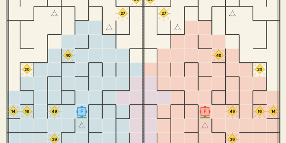

# Maze Crawler ISMCTS

A fixed-buffer Information Set Monte Carlo Tree Search agent for Kaggle Maze Crawler.

The repository implements a native C++20 engine exposed to Kaggle through a thin Python entrypoint. The engine combines a deterministic rule simulator, a player-centric hidden-information belief model, fixed-capacity state containers, and a fixed-arena ISMCTS search over bounded joint macro plans. The Python layer handles Kaggle lifecycle, native import and JIT compilation, and per-player engine caching.

<figure>
  
</figure>

## Overview

Maze Crawler is a two-player fog-of-war strategy game on a 20-column maze that scrolls north over time. Each player controls a single Factory and builds Scouts, Workers, and Miners to explore, collect energy, and outlast the opponent. The full rules are documented in [rules/README.md](./rules/README.md).

The agent searches over sampled hidden states. Each turn it updates a belief model from the observation, samples a concrete world per search iteration, replays a selected joint macro plan through the simulator, and evaluates the outcome with a shaped value function. Branching is compressed to a deterministic baseline plan plus one-robot macro deviations, which keeps the tree approximately linear in robot count.

## Key Characteristics

- Native C++20 hot path for belief, simulation, policy, and search.
- Fixed-capacity `std::array` storage with no dynamic allocation in the search loop.
- Structure-of-Arrays robot store and absolute map memory with active-window Bitboards.
- Root-parallel ISMCTS with per-thread arenas and aggregated root statistics.
- Source-first Kaggle packaging: the submission JIT-compiles the extension at runtime.
- Configuration-driven hyperparameters from `config/hyperparameters.json`.

## Repository Layout

```text
.
├── CMakeLists.txt            CMake build definition for the pybind11 extension
├── Makefile                  Convenience targets (build, test, tune, bench, package)
├── pyproject.toml            Tooling configuration (pytest, ruff)
├── requirements-dev.txt      Development dependencies
├── main.py                   Kaggle entrypoint (agent, native import, JIT)
├── submission.py             Local alias exposing main.agent
├── config/
│   ├── hyperparameters.json  Single source of truth for tuned parameters and bounds
│   └── league.json           Opponent registry for tuning and benchmarking
├── docs/
│   ├── BENCHMARKING.md       Evaluation protocol, promotion gate, Elo ladder
│   ├── TUNING.md             Tuning system deep dive
│   └── benchmarks/           Benchmark report output directory
├── opponents/                Hand-crafted opponent archetypes
├── rules/
│   ├── README.md             Authoritative competition rules
│   └── AGENTS.md             Getting-started guide
├── scripts/
│   ├── tune.py               Optuna tuning harness
│   ├── bench.py              Champion benchmark harness
│   ├── diffcheck.py          Differential rules-fidelity check
│   ├── profiling.py          Per-turn latency profiler and perf gate
│   └── package_submission.py Kaggle source bundle builder
├── src/
│   ├── crawler_engine_*.cpp  Native engine implementation files
│   └── include/              Engine headers (constants, enums, board, search, engine)
├── tests/                    pytest suite (bridge, sim, policy, search, packaging)
└── tuning/                   Reusable tuning package (schema, league, runner, reporting)
```

## Quickstart

### Prerequisites

- Python 3.11 or newer.
- CMake 3.20 or newer.
- A C++20 compiler with Python development headers.
- The packages in `requirements-dev.txt`.

### Set Up the Environment

```bash
python -m venv .venv
source .venv/bin/activate
python -m pip install --upgrade pip
python -m pip install -r requirements-dev.txt
```

### Build

```bash
make build
```

or directly:

```bash
cmake -S . -B build -DCMAKE_BUILD_TYPE=Release \
  -DPython3_EXECUTABLE="$(python -c 'import sys; print(sys.executable)')"
cmake --build build -j
```

### Test

```bash
make test
```

The suite covers the pybind bridge, rule-phase simulator behavior, deterministic policy macros, ISMCTS search behavior, packaging, and opponent archetypes. Run it directly with `PYTHONPATH=build python -m pytest -q tests`.

### Verify Rules Fidelity

```bash
make diffcheck
```

`scripts/diffcheck.py` plays short full games with the native agent and asserts the scroll cadence and game termination match the environment.

### Run a Minimal Local Call

```bash
PYTHONPATH=build python - <<'PY'
from types import SimpleNamespace
from main import agent

obs = SimpleNamespace(
    player=0, walls=[0] * 400, crystals={},
    robots={"f0": [0, 5, 2, 1000, 0, 0, 0, 0]},
    mines={}, miningNodes={}, southBound=0, northBound=19, step=0,
)
config = SimpleNamespace(width=20, workerCost=200, wallRemoveCost=100)
print(agent(obs, config))
PY
```

### Tune

```bash
make tune
```

The tuning harness runs Optuna studies against the opponent league with fixed seeds and seat rotation. See [docs/TUNING.md](./docs/TUNING.md) for details.

### Benchmark

```bash
make bench
```

The benchmark harness measures the champion against every league opponent on held-out seeds. See [docs/BENCHMARKING.md](./docs/BENCHMARKING.md) for details.

### Package and Submit

```bash
make package
kaggle competitions submit maze-crawler -f submission.tar.gz -m "maze-crawler-ismcts"
```

`scripts/package_submission.py` writes `submission.tar.gz` containing `main.py`, all C++ sources, the headers under `src/include/`, and vendored pybind11 headers. At runtime `main.py` imports a prebuilt extension if available, otherwise it JIT-compiles the sources.

## Documentation Map

- [ARCHITECTURE.md](./ARCHITECTURE.md): system layers, data flow, search loop, data model, algorithms, and Python API.
- [CONTRIBUTING.md](./CONTRIBUTING.md): development workflow, build and test guidance, code style, and how-to guides.
- [docs/TUNING.md](./docs/TUNING.md): tuning system, schema, Optuna runner, opponent league, and champion routing.
- [docs/BENCHMARKING.md](./docs/BENCHMARKING.md): evaluation protocol, confidence intervals, and the promotion gate.
- [rules/README.md](./rules/README.md): authoritative competition rules and configuration defaults.

## License

This repository is distributed under the Apache License 2.0. See [LICENSE](./LICENSE).
